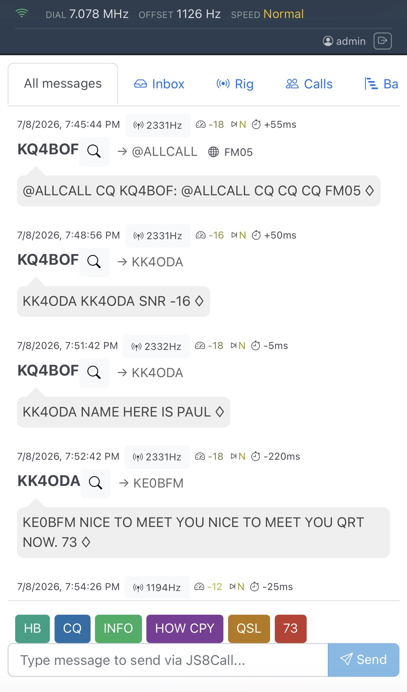
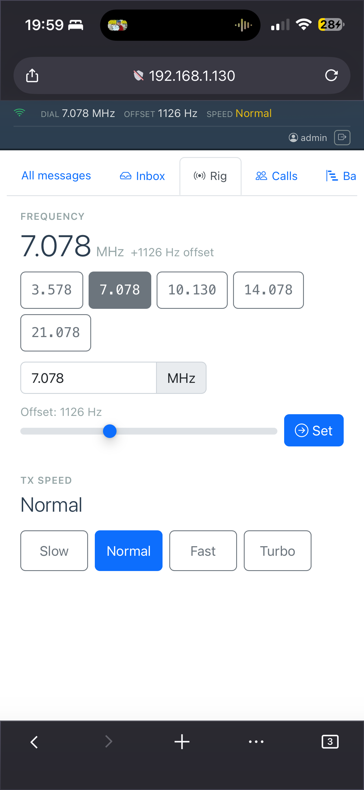
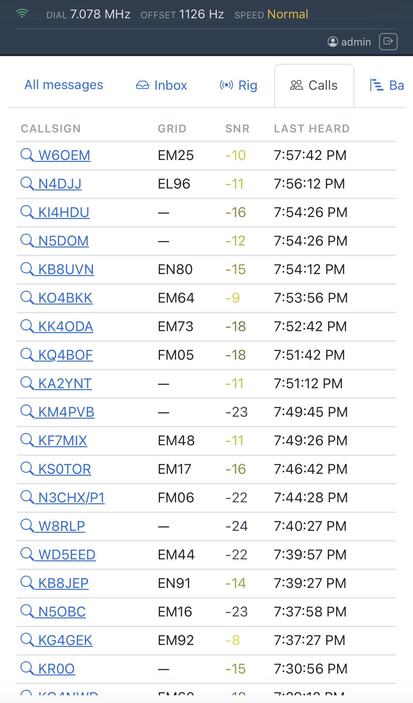
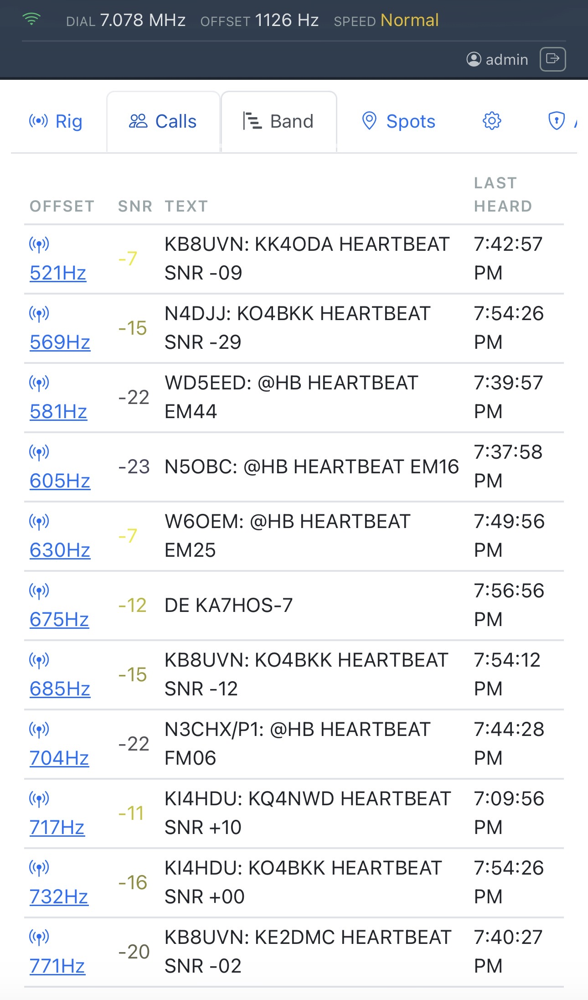
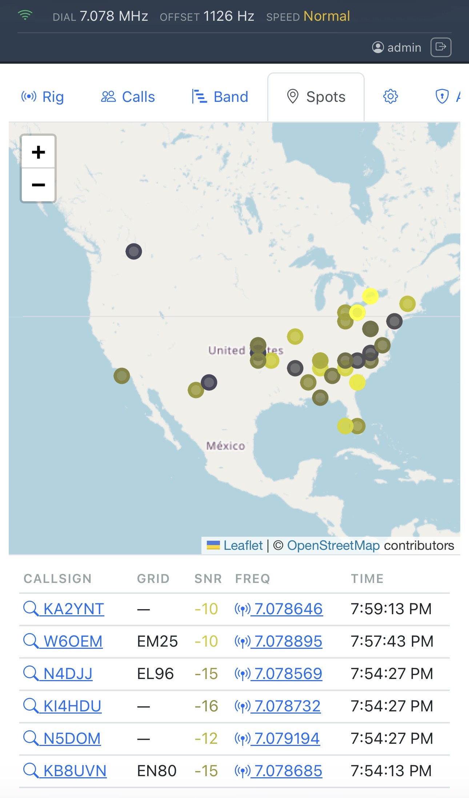
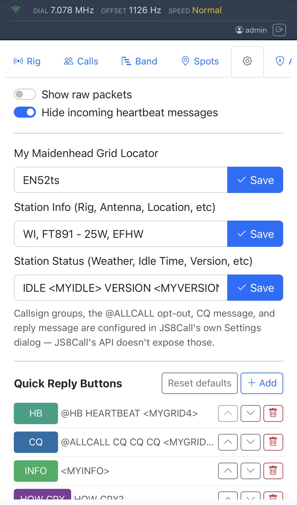

# js8web

Web-based monitor and control interface for [JS8Call](http://js8call.com/) — an amateur radio digital communication application.

js8web connects to a running JS8Call instance via its TCP API, captures received messages and station events in real time, stores them in a local SQLite database, and presents everything through a browser-accessible chat-style dashboard.

## Quick Start

```bash
# Build (requires Go 1.25+)
go build -o js8web .

# Run (JS8Call must be running with TCP API enabled on port 2442)
./js8web

# Open in browser
# http://localhost:8080
# Default login: admin / admin
```

## Features

- **Real-time chat** — received JS8Call messages displayed as they arrive via WebSocket
- **Filter tabs** — click any callsign's 🔍 icon or any frequency indicator to open a filtered tab; tabs auto-activate and deduplicate
- **@CALLSIGN compose** — when in a callsign-filtered tab, the compose input prepends `@CALLSIGN` automatically
- **Quick-reply buttons** — configurable one-tap reply buttons (CQ, INFO, HOW CPY, QSL, 73) with custom labels, colors, and message text; saved in browser localStorage; editable via Settings tab
- **TX message display** — transmitted messages show their actual text in the chat (not just "Transmitted frame")
- **Inbox tab** — view and send messages to JS8Call's built-in inbox; updates in real time
- **Rig Control tab** — set dial frequency (with 5 band presets: 80/40/30/20/15m), offset slider, TX speed mode (Slow/Normal/Fast/Turbo)
- **Calls tab** — live table of heard callsigns (grid, SNR, last heard) from JS8Call's call activity window
- **Band tab** — live table of current band activity by offset (SNR, decoded text, last heard)
- **Spots tab** — map (grid-derived location) and list of received station spots, color-coded by SNR
- **Station Details settings** — edit grid/info/status directly from js8web (JS8Call's callsign is read-only, not shown)
- **Hide-heartbeat filter** — optionally hide incoming HEARTBEAT messages from chat
- **Color-coded signal indicators** — SNR (blue→yellow→red), speed mode, time drift
- **Infinite scroll** — paginated message history loading
- **Mobile-friendly** — responsive layout, 44px+ touch targets on the tab bar and rig control buttons
- **Authentication** — cookie-based sessions; Admin/Operator/Monitor roles
- **User management** — admin panel for creating, editing, and deleting user accounts
- **SQLite persistence** — all activity logged; survives restarts
- **Single binary, pure Go** — embedded web interface; no CGo/GCC required to build

## Screenshots

| Chat | Rig Control |
|---|---|
|  |  |

| Calls | Band |
|---|---|
|  |  |

| Spots | Settings |
|---|---|
|  |  |

## Documentation

- **[User Manual](USER_MANUAL.md)** — installation, configuration, and full usage guide
- **[Development Documentation](DEVELOPMENT.md)** — architecture, code reference, API endpoints
- **[CLAUDE.md](CLAUDE.md)** — agent rules and codebase guide (for AI-assisted development)

## License

See [LICENSE](LICENSE) for details.
